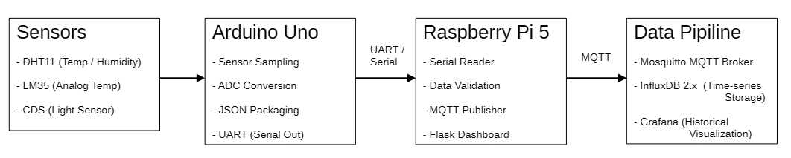

# 智慧環境監測系統
### （Arduino + Raspberry Pi 5，分散式 IoT 資料管線）

**核心重點：** 感測器–邊緣分工、資料管線、硬體感知系統設計

---

## 專案概述

此專案展示了一個 **完整的 IoT 環境監測管線**：

- Arduino Uno 用於 **即時感測器數據擷取與 ADC 處理**
- Raspberry Pi 5 作為 **基於 Linux 的邊緣節點**，負責驗證、訊息傳遞與視覺化
- **MQTT** 用於裝置間通訊
- **InfluxDB + Grafana** 用於時間序列資料儲存與歷史分析
- **Flask 儀表板** 用於即時監測與除錯

> 此專案強調 **明確的職責分工**，將微控制器層級 I/O 與 Linux 邊緣處理分離，反映真實世界 IoT 部署模式。

---

## 此專案解決了什麼問題？

此專案明確解決：
- 邊緣裝置的適性應用，**微控制器適合即時感測與 ADC**，而 **Linux 邊緣節點專注於驗證、訊息傳遞與儲存**
- **MQTT 如何支援可擴展的多節點感測架構**
- 將原始感測數據，經由 Edge 驗證、時間序列化與視覺化，轉化為可用於監控、趨勢分析與後續自動化決策的系統輸出

---

## 主要工程決策與發現

### 感測器–邊緣職責分工
- Arduino Uno 處理：
  - 感測器取樣
  - ADC 轉換（LM35、CDS）
  - JSON 封包生成
- Raspberry Pi 5 處理：
  - 資料驗證與閾值檢查
  - MQTT 發佈 / 訂閱
  - 視覺化與持久化

### 分層式資料管線設計
- 即時檢視：Flask 儀表板
- 長期分析：InfluxDB + Grafana
- 避免儀表板因歷史邏輯而過載

### 實務取捨與限制
- DHT11 僅用於示範，非精密監測
- UART 通訊假設環境穩定（尚無 CRC）
- 手動啟動服務反映原型階段

**結論：**
> 可擴展的 IoT 系統更依賴 **架構清晰度**，  
> 而非增加更多感測器或 UI 功能。

---

## Demo

**感測器擷取 → MQTT → 邊緣處理 → 視覺化**

示範影片：  
https://youtu.be/Ifh9Rky5IHM

系統架構：



---

**詳細實作與設計理由如下**

---
---

## 1. 系統架構

系統遵循 **分層式 IoT 架構**：

1. **感測層** – Arduino Uno  
2. **邊緣處理層** – Raspberry Pi 5  
3. **訊息層** – MQTT  
4. **儲存與視覺化層** – InfluxDB / Grafana / Flask  

此結構刻意設計為可擴展至多個感測節點。

---

## 2. 使用的感測器

- DHT11 – 溫度 / 濕度（數位）  
- LM35 – 類比溫度感測器  
- CDS（光敏電阻）– 環境光照強度  

類比感測器在 Arduino 上處理，以避免 Linux 的時間與 ADC 限制。

---

## 3. 硬體職責

### Arduino Uno
- 感測器輪詢
- ADC 轉換
- JSON 負載格式化
- UART 傳輸（每 2 秒）

### Raspberry Pi 5
- UART 資料接收與解析
- 資料驗證與合理性檢查
- MQTT 發佈 / 訂閱
- Flask 即時儀表板
- InfluxDB 時間序列寫入
- Grafana 歷史視覺化

---

## 4. 軟體堆疊

- Python 3  
- Flask  
- Mosquitto MQTT Broker  
- paho-mqtt  
- InfluxDB 2.x  
- Grafana  

---

## 5. 啟動流程

1. 啟動 Mosquitto MQTT broker  
2. 啟動 InfluxDB  
3. 啟動 Grafana  
4. 啟動 Arduino Uno  
5. 在 Raspberry Pi 5 上執行：

```bash
python publisher.py
python main.py
```

## 6. 專案目錄結構
```text
smart_environment_monitor/
├── arduino/
│   └── DHT11-LM35-CDS.ino
│
├── docs/
│   └── wiring.md
│   ├── requirements.txt
│   ├── system_arch.png
│   └── system_architecture.png
│
├── raspberry_pi/
│   ├── main.py
│   ├── publisher.py
│   ├── config.py
│   └── templates/
│       └── dashboard.html
│
├── screenshots_demo
│   ├── flask_dashboard.png
│   └── grafana_dashboard.png
│   └── influxdb_dashboard.png
|
└── README.md
```

## License Notice

The source code in this repository is released under the MIT License.

Demo materials, including videos, photos, logs, and generated data under the following directories are provided for demonstration purposes only and are NOT covered by the MIT License:

- screenshots_demo/

These materials may not be redistributed or reused without explicit permission.